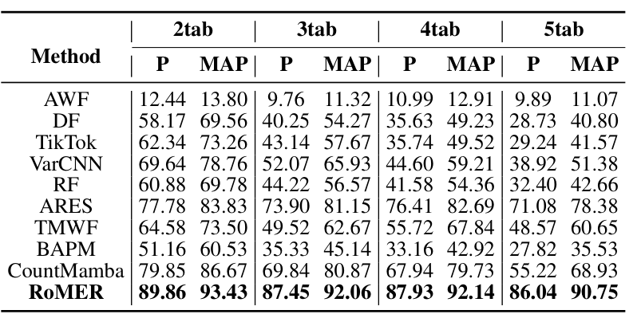
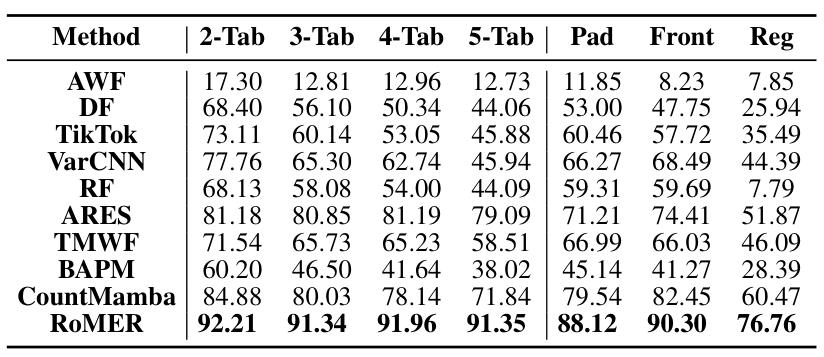

# RoMER

**RoMER: Query-Driven Evidence Decoupling for Robust Multi-label Website Fingerprinting**（基于查询驱动的证据解耦的鲁棒多标签网站指纹识别）

*官方实现。论文正在投稿中。*

[English](README.md) | [中文](README_zh.md)

RoMER 是一个面向多标签页（multi-tab）流量的网站指纹识别（WF）攻击框架，支持封闭世界和开放世界场景，以及常见的流量防御（WTF-PAD、FRONT 和 RegulaTor）。

## 仓库结构

```
.
├── data_process/            # 数据集处理
│   ├── convert_multi_tab_npz.py   # ARES 原始数据 → (X, y) 格式
│   └── dataset_split.py     #   数据集划分
├── defense_npz/             # 流量防御（直接操作 npz）
│   ├── wtfpad/              #   WTF-PAD
│   ├── front/               #   FRONT
│   └── regulartor/          #   RegulaTor
├── wfa_main/
│   ├── Model_Dataset/       # RoMER 模型与数据集
│   │   ├── model_romer.py   #   RoMER 模型（EM1 / EM3 变体）
│   │   ├── model_base.py
│   │   └── dataset.py       #   TAM 特征提取
│   └── run/                 # 训练 / 测试入口
│       ├── main.py          #   训练
│       ├── test.py          #   评估
│       ├── config/Romer.ini
│       └── ...
├── lxj_utils_sys/           # 共享工具库
├── requirements.txt
└── README.md
```

## 1. 依赖安装

```shell
conda create -n romer python=3.10
conda activate romer
# PyTorch (CUDA 11.8)
pip install torch==2.1.2 torchvision==0.16.2 torchaudio==2.1.2 --index-url https://download.pytorch.org/whl/cu118
# 其他依赖
pip install -r requirements.txt
```

安装完成后，将仓库根目录添加到 `PYTHONPATH`：

```shell
cd <repo_root>
export PYTHONPATH=$PWD
```

第 4 节的所有攻击脚本在 `wfa_main/run` 目录下运行：

```shell
cd wfa_main/run
```

## 2. 数据集

### 2.1 下载数据集

多标签页流量基于 ARES 多标签页网站指纹数据集收集：

- **ARES 数据集**：[https://github.com/Xinhao-Deng/Multitab-WF-Datasets](https://github.com/Xinhao-Deng/Multitab-WF-Datasets)

下载每种场景的 ARES 原始数据，并将 `data.npz` 文件放到 `npz_dataset/{dataset}/data.npz`。原始 `data.npz` 包含 `direction`、`time` 和 `label`。将其转换为 RoMER 使用的 `(X, y)` 格式，其中 `X` 是形状为 `(N, L, 2)` 的流量（`时间戳, 数据包长度`），`y` 是形状为 `(N, C)` 的多标签指示矩阵：

```shell
cd data_process
for dataset in Closed_2tab Closed_3tab Closed_4tab Closed_5tab Open_2tab Open_3tab Open_4tab Open_5tab
do
  python convert_multi_tab_npz.py --dataset ${dataset}
done
```

**所有规范化好的数据可以在此处下载：[https://zenodo.org/uploads/21769044](https://zenodo.org/uploads/21769044)**

### 2.2 数据集划分

将每个数据集划分为 `train.npz`、`valid.npz` 和 `test.npz`：

```shell
cd data_process
for dataset in Closed_2tab Closed_3tab Closed_4tab Closed_5tab Open_2tab Open_3tab Open_4tab Open_5tab
do
  python dataset_split.py --dataset ${dataset} --use_stratify False
done
```

## 3. 防御数据集

使用 WTF-PAD、FRONT 和 RegulaTor 生成防御数据集。每个防御读取 `npz_dataset/{dataset}/data.npz` 并输出防御后的 `data.npz`。

### 3.1 生成防御流量

```shell
# WTF-PAD
cd defense_npz/wtfpad
python main.py --traces_path ../../npz_dataset/Closed_2tab --output_path ../results/wtfpad_Closed_2tab
python main.py --traces_path ../../npz_dataset/Open_2tab   --output_path ../results/wtfpad_Open_2tab

# FRONT
cd ../front
python main.py --p ../../npz_dataset/Closed_2tab --output_path ../results/front_Closed_2tab
python main.py --p ../../npz_dataset/Open_2tab   --output_path ../results/front_Open_2tab

# RegulaTor
cd ../regulartor
python regulator_sim.py --source_path ../../npz_dataset/Closed_2tab --output_path ../results/regulator_Closed_2tab
python regulator_sim.py --source_path ../../npz_dataset/Open_2tab   --output_path ../results/regulator_Open_2tab
```

### 3.2 复制并划分

将防御后的 `data.npz` 文件复制到 `npz_dataset/` 并划分：

```shell
cd ../..
for ds in wtfpad front regulator
do
  for scen in Closed_2tab Open_2tab
  do
    mkdir -p npz_dataset/${ds}_${scen}
    cp defense_npz/results/${ds}_${scen}/data.npz npz_dataset/${ds}_${scen}/data.npz
  done
done

cd data_process
for dataset in wtfpad_Closed_2tab wtfpad_Open_2tab front_Closed_2tab front_Open_2tab regulator_Closed_2tab regulator_Open_2tab
do
  python dataset_split.py --dataset ${dataset} --use_stratify False
done
```

## 4. 网站指纹攻击脚本

在多标签页数据集上训练和评估 RoMER。每个数据集用 `main.py` 训练、用 `test.py` 评估（两者使用相同的 `--note`，因此复用同一个 checkpoint）。

### 4.1 无防御流量（封闭世界与开放世界）

```shell
cd wfa_main/run

# 封闭世界
for dataset in Closed_2tab Closed_3tab Closed_4tab Closed_5tab
do
  python main.py --dataset ${dataset} --config config/Romer.ini \
      --checkpoint_path ../../checkpoints --file_base_dir ../../npz_dataset \
      --note romer --Model_name EM3 --TAM_type ED3 --test_flag False \
      --train_epochs 30 --overlap_ratio 0.1 --valid_name valid --remove_size False
  python test.py --dataset ${dataset} --config config/Romer.ini \
      --checkpoint_path ../../checkpoints --file_base_dir ../../npz_dataset \
      --note romer --Model_name EM3 --TAM_type ED3 --test_flag False \
      --load_ratio 100 --overlap_ratio 0.1 --is_pr_auc True --first_check_ratio True --remove_size False
done

# 开放世界
for dataset in Open_2tab Open_3tab Open_4tab Open_5tab
do
  python main.py --dataset ${dataset} --config config/Romer.ini \
      --checkpoint_path ../../checkpoints --file_base_dir ../../npz_dataset \
      --note romer --Model_name EM3 --TAM_type ED3 --test_flag False \
      --train_epochs 30 --overlap_ratio 0.1 --valid_name valid --remove_size False
  python test.py --dataset ${dataset} --config config/Romer.ini \
      --checkpoint_path ../../checkpoints --file_base_dir ../../npz_dataset \
      --note romer --Model_name EM3 --TAM_type ED3 --test_flag False \
      --load_ratio 100 --overlap_ratio 0.1 --is_pr_auc True --first_check_ratio True --remove_size False
done
```

### 4.2 防御流量

```shell
cd wfa_main/run

for dataset in wtfpad_Closed_2tab wtfpad_Open_2tab front_Closed_2tab front_Open_2tab regulator_Closed_2tab regulator_Open_2tab
do
  python main.py --dataset ${dataset} --config config/Romer.ini \
      --checkpoint_path ../../checkpoints --file_base_dir ../../npz_dataset \
      --note romer --Model_name EM3 --TAM_type ED3 --test_flag False \
      --train_epochs 30 --overlap_ratio 0.1 --valid_name valid --remove_size False
  python test.py --dataset ${dataset} --config config/Romer.ini \
      --checkpoint_path ../../checkpoints --file_base_dir ../../npz_dataset \
      --note romer --Model_name EM3 --TAM_type ED3 --test_flag False \
      --load_ratio 100 --overlap_ratio 0.1 --is_pr_auc True --first_check_ratio True --remove_size False
done
```

## 实验结果

下图总结了 RoMER 在多标签页数据集上的性能，涵盖封闭世界和开放世界场景以及防御流量（WTF-PAD、FRONT、RegulaTor）。

### 封闭世界



### 开放世界



## 引用

如果您觉得这个仓库有用，请考虑引用我们的论文：

```bibtex
@misc{romer2026query,
  title = {RoMER: Query-Driven Evidence Decoupling for Robust Multi-label Website Fingerprinting},
  author = {TBD},
  year = {2026},
  note = {Under submission}
}
```

论文正在投稿中；BibTeX 条目将在论文被接收后更新。
